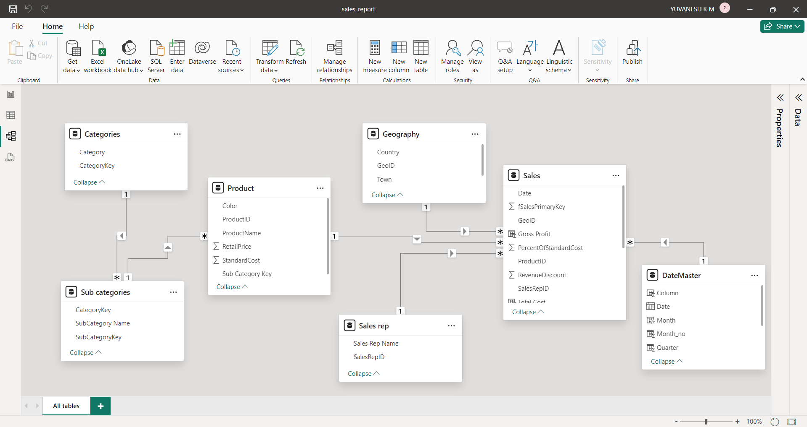

# Retail Sales Report

# Project steps:

## Requirement Gathering:
* Gathering requirements involves understanding the objectives, scope, and constraints of the project. This typically involves creating
    * BRD (Business Requirement Document)
    * FRD (Functional Requirement Document)
* Here, for this project both BRD and FRD are given in a single pdf file.

## Data Collection:
* The data for this project is collected from various sourses like Excel Spread sheet, CSV file, MySQL Database, and from a folder containing multiple files each containing similar data.

## Data Cleaning and Preprocessing:
* Data that comes from different sources is not in the proper format. So, we need to clean the data, as well as if needed we can add new columns to the existing table or we can create new table.
* The Data Cleaning is done with the help of DAX (Data Analysis Expression) in Power BI.

## Data Modelling:

* Data Modelling
* UI Report (charts / graphs / custom charts)
* Additional Information (DAX Calculation) DAX--->Data Analysis Expression
* RLS (Role Level Security)
* Create Workspace (Provide workspace access within the team)
* Publish
* Dashboard
* Gateway
* Schedule Refresh
* Add Roles, Subscribe, alerts
* Share the Report
* Create App and Share